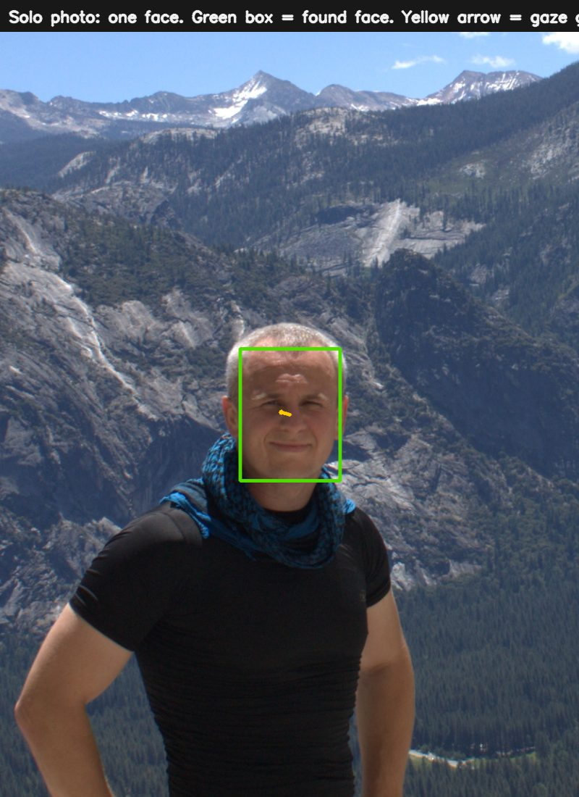
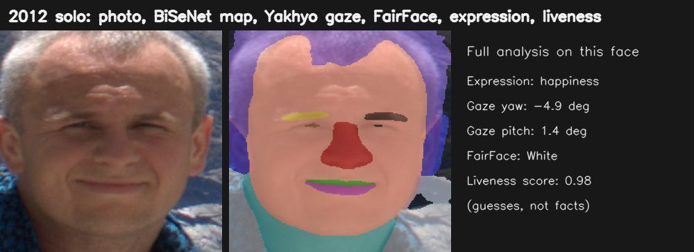
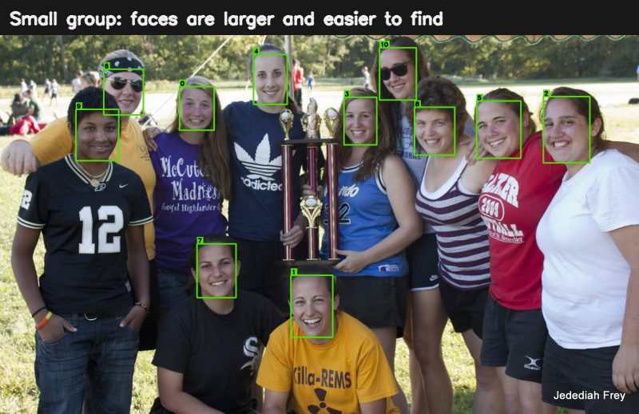
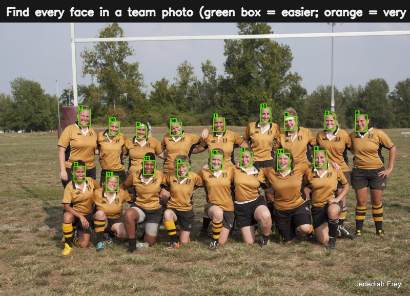
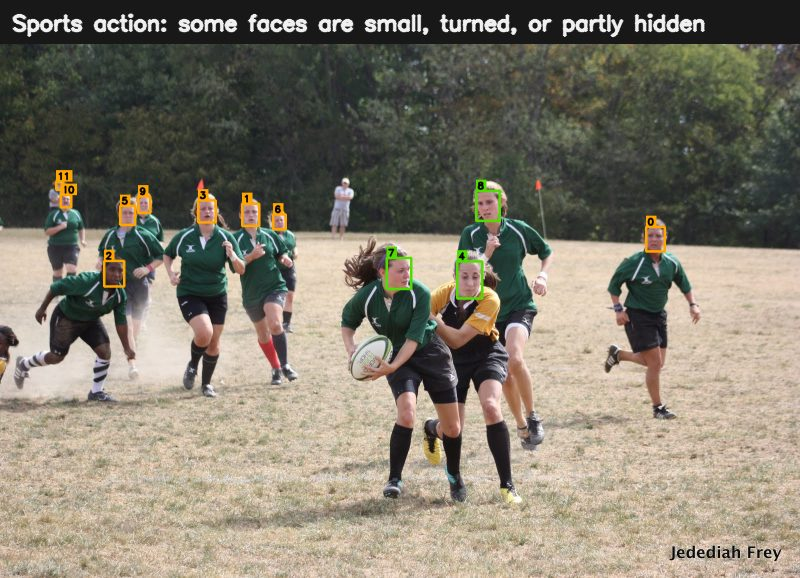
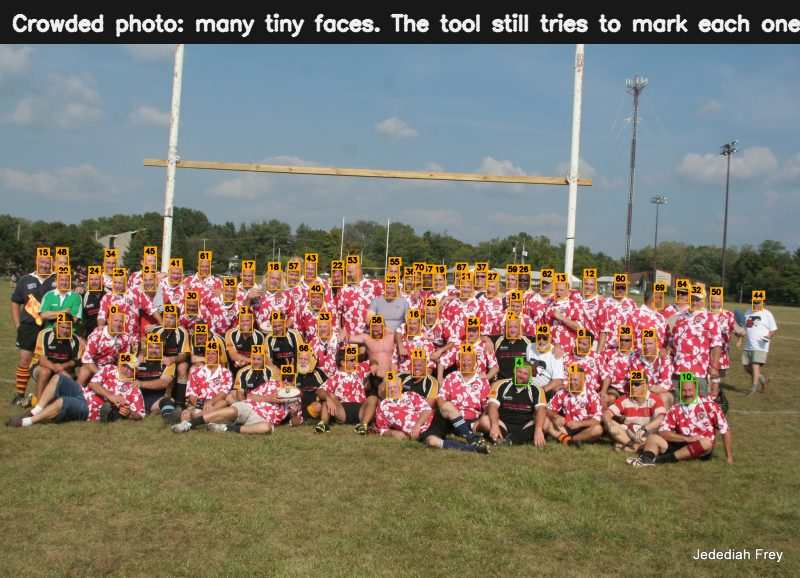
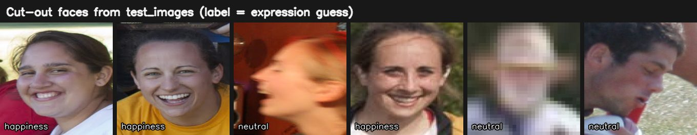
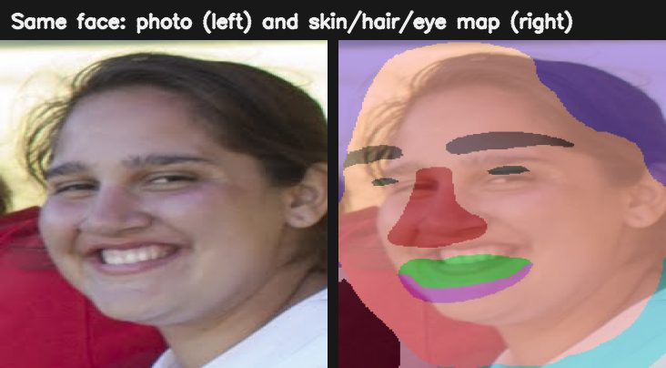
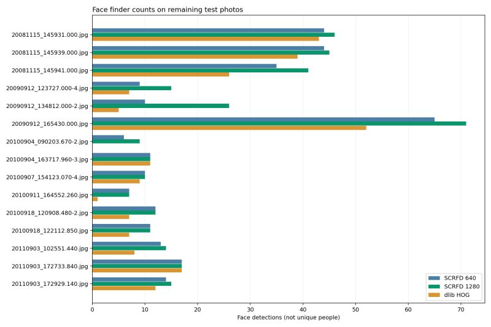

# meta-face

**meta-face** looks at a folder of photos. It finds faces. It writes what it found next to each photo.

You do not need to rename files. You do not need to change the photos. The extra notes go in a small sidecar file named `.scar`.

If `photo.jpg` is the picture, the notes are in `photo.scar`.

---

## What this project is for

A sports or family folder can have hundreds of pictures. Some pictures have one face. Some have a whole team.

This tool tries to answer simple questions:

1. Where are the faces?
2. How many faces are in this picture?
3. Which faces look like the same person in other pictures?
4. What extra guesses can we make (smile, head turn, skin vs hair)?

The pictures below come from the `test_images/` folder in this project.

### 1. Find faces

The green box is a face the tool found. An orange box is also a face, but it is very small in the photo.

**Solo photo.** One face. Easy. The yellow arrow is a **gaze guess** (Yakhyo): which way the eyes look.



The same face also gets extra guesses: expression, a skin/hair map, Yakhyo gaze numbers, and a FairFace label. These are model guesses, not facts.



**Small group.** Faces are larger and easier to find.



**Team photo.** Many faces in rows.



**Action photo.** People run. Heads turn. Some faces are hard to see.



**Crowd photo.** Many tiny faces. The tool still tries to mark each one.



### 2. Cut out each face

After it finds a face, it can cut that face out. Other tools then look at the small cut-out, not the whole photo.

The word under each face is an **expression guess**. A guess can be wrong. Sunglasses, side views, and blur make guesses harder.



### 3. Map parts of a face

Some tools do not only say “this is a face.” They color the pixels: skin, hair, eyes, mouth.

Left: the photo. Right: the color map on the same face (from the solo picture above).



### 4. Different tools count differently

This project runs more than one finder. They do not always agree. That is useful. It shows which photos are easy and which photos need a human look.



In this test set:

- The main face finder (SCRFD at a larger size) found **350** faces across **15** photos.
- Another face finder (dlib) found **244** faces.

Rebuild these pictures from `test_images/` with:

```bash
python scripts/generate_readme_examples.py
```

---

## Tools it uses

Think of the project as a **toolbox**. One program (`mf`) can call many models. Each model has one job.

### Find faces

| Tool | Job in plain words |
|------|--------------------|
| [InsightFace](https://github.com/deepinsight/insightface) / **SCRFD** | Find faces and a few key points (eyes, nose, mouth). This is the main face finder. |
| [dlib](http://dlib.net/) / [face_recognition](https://github.com/ageitgey/face_recognition) | A second face finder. It can catch faces the first finder misses, and the other way around. |

### Turn a face into a fingerprint

| Tool | Job in plain words |
|------|--------------------|
| **ArcFace** (also from InsightFace) | Turn a face into 512 numbers. Similar people get similar numbers. |
| **dlib embedding** | The same idea, with 128 numbers. A second fingerprint. |
| [FAISS](https://github.com/facebookresearch/faiss) + [HDBSCAN](https://github.com/scikit-learn-contrib/hdbscan) | Group fingerprints so “same looking person” photos sit together. This is grouping, not a legal ID. |

### Extra guesses on each face

These tools usually look at the cut-out face after SCRFD finds it. Some big kits (DeepFace, UniFace, Py-Feat) can also find faces on their own.

| Tool | Job in plain words |
|------|--------------------|
| OpenCV FER, FER+, EmotiEffLib, EmoNet | Guess expression (smile, surprise, …). |
| [MediaPipe](https://developers.google.com/mediapipe) Face Landmarker | Many face points, plus blendshapes (how open is the mouth, …). |
| Yakhyo gaze, L2CS-Net | Guess where the eyes look. |
| FairFace | Guess age group, gender, and race. These are model guesses, not facts. |
| BiSeNet | Color map of hair, skin, eyes, mouth. |
| MiniFASNet and other anti-spoof tools | Guess “live face vs print/screen.” A still photo cannot prove a live person. |
| LibreFace, OpenFace 3, Py-Feat | Face muscle / behavior scores. |
| DeepFace, UniFace, InspireFace | Larger kits: find faces, fingerprints, and more analysis in one package. |

### Save the notes

| Tool | Job in plain words |
|------|--------------------|
| [sidecar-rs](https://github.com/dapperfu/sidecar-rs) | Write and update `.scar` files next to each photo. Another project ([meta_pose](../meta_pose)) can write pose and body notes into the same file. |

You can list what is installed on your machine:

```bash
mf tools
mf backends
```

---

## How to run it

You need:

- Python 3.10 or newer
- A NVIDIA GPU with CUDA (the default install uses GPU packages)
- Rust (to build sidecar-rs)
- Docker only if you want Redis workers for a large folder

Install and scan a folder:

```bash
docker compose up -d
pip install -e ".[dev]"
mf download
mf worker                 # terminal 1
mf scan /path/to/photos   # terminal 2
```

Or run on this machine with no queue:

```bash
mf scan /path/to/photos --run-now
```

Useful commands:

| Command | What it does |
|---------|----------------|
| `mf scan PATH` | Find photos and run the chosen tools |
| `mf cluster PATH` | Group similar face fingerprints |
| `mf annotate PATH` | Draw boxes onto a copy of the photo |
| `mf info PATH` | Print what is in the `.scar` file |
| `mf download` | Download model files |

Default `mf scan` runs InsightFace and face_recognition. It does not group people until you cluster:

```bash
mf scan /photos --tools insightface,face_recognition,hdbscan
mf scan /photos --tools scrfd,expression --run-now
```

More detail: [notebooks/](notebooks/), [SDK tools](docs/SDK_TOOLS.md), [coordinates](docs/COORDINATES.md).

---

## 中文说明

**meta-face** 会查看一个照片文件夹。它找出人脸。它把结果写在每张照片旁边。

它不会改你的照片文件名。它也不会改照片本身。额外信息写在一个叫 `.scar` 的小文件里。

如果照片是 `photo.jpg`，结果就在 `photo.scar`。

### 这个项目做什么

一个运动或家庭相册里，可能有几百张照片。有的只有一张脸。有的是整支球队。

这个工具想回答这些简单问题：

1. 脸在哪里？
2. 这张照片里有几张脸？
3. 哪些脸看起来像同一个人？
4. 还能猜什么（微笑、转头、皮肤和头发）？

下面的图都来自本项目的 `test_images/` 文件夹。

### 1. 找人脸

绿框是找到的脸。橙框也是脸，但在照片里非常小。

**单人照片。** 一张脸。比较容易。黄箭头是**视线猜测**（Yakhyo）：眼睛大概在看哪个方向。


同一张脸还会有更多猜测：表情、皮肤/头发分区、Yakhyo 视线数字，以及 FairFace 标签。这些都是模型猜测，不是事实。


**小组合影。** 脸更大，更容易找。


**合影。** 很多脸排成几排。


**运动照片。** 人在跑。头会转。有的脸不好看清。


**大合影。** 很多很小的脸。工具仍会尽量给每张脸做标记。


### 2. 切出每张脸

找到脸以后，可以切出这张脸。后面的工具看这个小图，而不是整张大图。

每张脸下面的词是**表情猜测**。猜测可能错。墨镜、侧脸、模糊都会让猜测更难。


### 3. 标出脸上的部位

有的工具不只说“这是一张脸”。它们会给像素上色：皮肤、头发、眼睛、嘴。

左边：原图。右边：同一张脸上的彩色图（来自上面的单人照片）。


### 4. 不同工具数出来的数量不一样

这个项目会用不止一种查找方式。它们不一定完全一样。这很有用。它能告诉你哪些照片简单，哪些照片需要人来看。


在这组测试照片里：

- 主要的人脸查找（更大尺寸的 SCRFD）在 **15** 张照片里找到 **350** 张脸。
- 另一种人脸查找（dlib）找到 **244** 张脸。

用下面的命令，可以从 `test_images/` 重新生成这些图：

```bash
python scripts/generate_readme_examples.py
```

### 它用了哪些工具

可以把这个项目看成一个**工具箱**。一个程序（`mf`）可以调用很多模型。每个模型做一件事。

**找人脸**

| 工具 | 用白话说 |
|------|----------|
| InsightFace / **SCRFD** | 找人脸，以及几个关键点（眼睛、鼻子、嘴）。这是主要的人脸查找。 |
| dlib / face_recognition | 第二种人脸查找。第一种漏掉的，它有时能找到。反过来也一样。 |

**把脸变成“指纹”**

| 工具 | 用白话说 |
|------|----------|
| **ArcFace**（也来自 InsightFace） | 把一张脸变成 512 个数字。长得像的人，数字也更像。 |
| **dlib embedding** | 同样的想法，但是 128 个数字。第二种指纹。 |
| FAISS + HDBSCAN | 把指纹分组，让“看起来像同一个人”的照片靠在一起。这是分组，不是法律意义上的身份证明。 |

**对每张脸再猜一些信息**

这些工具通常先看 SCRFD 切出的小脸图。有些大工具包（DeepFace、UniFace、Py-Feat）也可以自己找脸。

| 工具 | 用白话说 |
|------|----------|
| OpenCV FER、FER+、EmotiEffLib、EmoNet | 猜表情（笑、惊讶等）。 |
| MediaPipe Face Landmarker | 很多脸部点，还有 blendshapes（嘴张多大等）。 |
| Yakhyo gaze、L2CS-Net | 猜眼睛在看哪里。 |
| FairFace | 猜年龄段、性别、种族。这是模型猜测，不是事实。 |
| BiSeNet | 给头发、皮肤、眼睛、嘴上色。 |
| MiniFASNet 和其他防假脸工具 | 猜“真人还是照片/屏幕”。单张静态照片不能证明是真人。 |
| LibreFace、OpenFace 3、Py-Feat | 脸部肌肉 / 行为分数。 |
| DeepFace、UniFace、InspireFace | 更大的工具包：找脸、指纹，以及更多分析。 |

**保存结果**

| 工具 | 用白话说 |
|------|----------|
| sidecar-rs | 在每张照片旁边写入和更新 `.scar` 文件。另一个项目（meta_pose）可以把姿势和人体信息写进同一个文件。 |

查看你这台电脑上装了哪些工具：

```bash
mf tools
mf backends
```

### 怎么运行

你需要：

- Python 3.10 或更新
- 带 CUDA 的 NVIDIA 显卡（默认安装使用 GPU 软件包）
- Rust（用来编译 sidecar-rs）
- 只有在处理很大的文件夹、需要 Redis 工人时，才需要 Docker

安装并扫描文件夹：

```bash
docker compose up -d
pip install -e ".[dev]"
mf download
mf worker                 # 第一个终端
mf scan /path/to/photos   # 第二个终端
```

或者在这台机器上直接跑，不用队列：

```bash
mf scan /path/to/photos --run-now
```

常用命令：

| 命令 | 做什么 |
|------|--------|
| `mf scan PATH` | 找照片，并运行你选的工具 |
| `mf cluster PATH` | 把相似的人脸指纹分组 |
| `mf annotate PATH` | 在照片副本上画框 |
| `mf info PATH` | 打印 `.scar` 文件里的内容 |
| `mf download` | 下载模型文件 |

默认的 `mf scan` 会运行 InsightFace 和 face_recognition。它不会自动把人分组。分组需要再运行 cluster：

```bash
mf scan /photos --tools insightface,face_recognition,hdbscan
mf scan /photos --tools scrfd,expression --run-now
```

更多说明：[notebooks/](notebooks/)、[SDK 工具](docs/SDK_TOOLS.md)、[坐标](docs/COORDINATES.md)。
