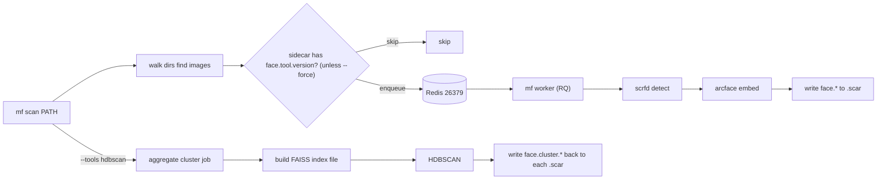

# meta-face: SCRFD + ArcFace + HDBSCAN/FAISS pipeline into sidecar-rs

## Confirmed decisions
- Embedding: ArcFace only, via `insightface` (SCRFD + ArcFace ONNX, `buffalo_l`).
- Stateless: `.scar` sidecars are the source of truth; FAISS index is a single file in a data dir. No database.
- Clustering: a separate aggregate job reads all embeddings from sidecars, builds a FAISS index, runs HDBSCAN, and writes cluster ids/labels back into each image's sidecar.
- Packaging: `pyproject.toml` with hatchling, `src/meta_face/` layout, entry points `meta-face` and `mf`.
- GPU: always require GPU deps (`onnxruntime-gpu`, `faiss-gpu-cu12`); installs anywhere, runs on the GPU host.
- Sidecar shape: full records (bbox, landmarks, det_score, embeddings) plus per-tool `version` + `processed_at`.
- docker-compose: Redis only on host port `26379` (6379 + 20000); workers run via `mf worker`.
- Images: jpg/jpeg/png/webp/bmp/tiff + HEIC/HEIF (`pillow-heif`).
- Scope: full runnable structure (ML inference exercised on the GPU host later).

## Data flow

## Sidecar key layout (per image .scar)
- `face.scrfd.version`, `face.scrfd.processed_at`, `face.scrfd.faces` = list of `{bbox:[x1,y1,x2,y2], landmarks:[[x,y]*5], det_score}`
- `face.arcface.version`, `face.arcface.processed_at`, `face.arcface.embeddings` = list of float vectors (aligned 1:1 with scrfd faces)
- `face.cluster.version`, `face.cluster.processed_at`, `face.cluster.labels` = per-face cluster ids (-1 = noise)

## Package structure (`src/meta_face/`)
- `cli.py` - Click group with `meta-face`/`mf`; commands `scan`, `worker`, `cluster`, `info`.
- `config.py` - Redis host/port (`26379`), queue name, data dir (`~/.meta_face` or `META_FACE_DATA`), model name, image extensions.
- `queue.py` - RQ `Redis`/`Queue` connection + enqueue helpers.
- `worker.py` - start N RQ workers (`mf worker --workers 4`, multiprocessing).
- `scanner.py` - recursive image discovery + per-tool skip logic.
- `sidecar.py` - thin wrapper over `sidecar_rs`: resolve `photo.jpg`->`photo.scar`, `has_tool(doc, tool)`, read/write `face.*` records.
- `imaging.py` - load images (incl. HEIC via `pillow-heif`) to ndarray.
- `tools/registry.py` - maps `--tools` names (`scrfd`, `arcface`, `hdbscan`) to per-image vs aggregate handlers + dependencies.
- `tools/scrfd.py` - SCRFD detection (insightface), cached model.
- `tools/arcface.py` - ArcFace embedding from aligned faces.
- `tools/cluster.py` - aggregate: collect embeddings, FAISS index, HDBSCAN, write back.
- `jobs.py` - RQ entrypoints: `process_image(path, tools, force)`, `run_cluster(root, force)`.

## CLI behavior
- `mf scan PATH [--force] [--tools scrfd,arcface,hdbscan] [--recursive/--no-recursive]` - enqueue per-image jobs for selected per-image tools; if `hdbscan` requested, enqueue one aggregate cluster job (depends on per-image jobs).
- `mf worker [--workers N]` - run RQ worker(s).
- `mf cluster PATH [--force]` - run/enqueue clustering only.
- `mf info PATH` - print decoded `face.*` data from a sidecar.
- Default `--tools` = `scrfd,arcface`. Skip rule: per-tool `face.<tool>.version` present => skip unless `--force`.

## Supporting files
- `pyproject.toml` (hatchling, deps: `click`, `rq`, `redis`, `insightface`, `onnxruntime-gpu`, `numpy`, `opencv-python-headless`, `hdbscan`, `faiss-gpu-cu12`, `pillow`, `pillow-heif`, `sidecar_rs @ git+https://github.com/dapperfu/sidecar-rs.git`; scripts `meta-face`/`mf`).
- `docker-compose.yml` - `redis:7` service, `26379:6379`, named volume, healthcheck.
- `.gitignore` - required LaTeX artifact patterns (per rule) + Python + `data/`/model caches + venv.
- `README.md` - install, docker, usage, sidecar key reference.

## Git compliance (.cursor/rules/git)
- Configure `git config user.name "$(whoami) | Cursor.sh | Auto"` and `user.email "$(whoami)@$(hostname).local"` before first commit.
- No git remote is configured and there is no `upstream`, so upstream-sync and push steps are skipped (push only if a remote exists).
- Atomic commit per file as created, using the mandated commit-format (summary, change list, `-----`, technical attribution block with Prompt/Context/Justification/Model/Tokens).

## Notes / risks
- `sidecar_rs` is a PyO3/Rust package; installing from git requires a Rust toolchain on the target host (it is reported already installed there).
- `faiss-gpu-cu12` availability depends on the host CUDA; will document a fallback to `faiss-cpu` if needed.
- ArcFace embeddings stored as plain float arrays in CBOR (sidecar supports nested arrays).
