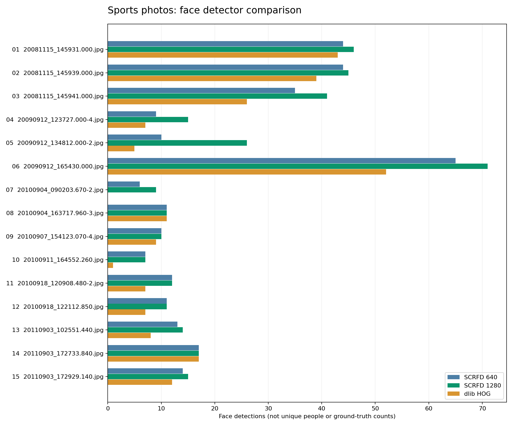

# Sports photo analysis

Completed analysis of all **15 JPEGs** in `test_images/`. Original file hashes were verified unchanged. Results include sidecars, per-photo observations, detector comparisons, facial geometry, expression estimates, gaze estimates, segmentation masks, and image-quality measurements.

## Main findings

- **350 face instances** detected with SCRFD at 1280, versus **308** at 640: 42 additional detections (+13.6%). These are detections across photos, not unique people or audited ground truth.
- **244 dlib HOG detections**. Disagreement is a review signal, not a correctness score.
- **140/350 faces (40.0%)** are under 40 native pixels on their shorter side. Median face width is approximately 43 pixels. Resizing these crops cannot restore missing detail.
- **274 faces** yielded spatially checked MediaPipe meshes and 52 blendshapes; 76 attempts yielded no result or a mesh outside the expected face box.
- The two expression models agree on **229/350 labels**. Treat these as uncertain visual-expression estimates; neither agreement nor a high model score establishes a person's feelings.



## Collection and photographic review

The collection contains team/trophy frames, rugby action frames, rugby gatherings, and one indoor candid. Files span 2008–2011. Total source size is 24.08 MB.

Capture metadata, dimensions, file sizes, and quality measurements are in [photos.csv](photos.csv).

Strong selection candidates from the visual review are the compact trophy portrait `20100904_163717.960-3.jpg`, the organized team portrait `20110903_172733.840.jpg`, and the running rugby action in `20100918_120908.480-2.jpg`. These are editorial suggestions, not automatic keep/reject decisions.

The indoor candid `20100911_164552.260.jpg` has visible motion blur and a recorded 1/15 s exposure. It is the clearest case where moving subjects limit facial detail.

The largest near-white pixel fractions are in `20090912_134812.000-2.jpg` (17.60%), `20110903_172929.140.jpg` (14.74%), and `20090912_123727.000-4.jpg` (10.12%). Sky and pale objects contribute to these values; this is not a measured percentage of overexposed faces.

Global sharpness is intentionally **not used to rank photographs**. The clear close portrait has a low whole-image Laplacian score because its background is soft, while textured grass can give wide action frames high scores. Compare native face crops and similar compositions instead.

## Per-photo results

Open **overlay** for SCRFD boxes and five landmarks; amber boxes flag faces under 40 pixels. Open **crops** for every detected face with its photo-local index, native size and detection score. Indices do not link identities across photos.

| # | Photo | SCRFD 640 | SCRFD 1280 | dlib | Small faces | Review |
|---:|---|---:|---:|---:|---:|---|
| 01 | 20081115_145931.000.jpg | 44 | 46 | 43 | 14 | [overlay](overlays/20081115_145931.000.jpg) · [crops](face_sheets/20081115_145931.000.jpg) |
| 02 | 20081115_145939.000.jpg | 44 | 45 | 39 | 15 | [overlay](overlays/20081115_145939.000.jpg) · [crops](face_sheets/20081115_145939.000.jpg) |
| 03 | 20081115_145941.000.jpg | 35 | 41 | 26 | 16 | [overlay](overlays/20081115_145941.000.jpg) · [crops](face_sheets/20081115_145941.000.jpg) |
| 04 | 20090912_123727.000-4.jpg | 9 | 15 | 7 | 7 | [overlay](overlays/20090912_123727.000-4.jpg) · [crops](face_sheets/20090912_123727.000-4.jpg) |
| 05 | 20090912_134812.000-2.jpg | 10 | 26 | 5 | 0 | [overlay](overlays/20090912_134812.000-2.jpg) · [crops](face_sheets/20090912_134812.000-2.jpg) |
| 06 | 20090912_165430.000.jpg | 65 | 71 | 52 | 69 | [overlay](overlays/20090912_165430.000.jpg) · [crops](face_sheets/20090912_165430.000.jpg) |
| 07 | 20100904_090203.670-2.jpg | 6 | 9 | 0 | 4 | [overlay](overlays/20100904_090203.670-2.jpg) · [crops](face_sheets/20100904_090203.670-2.jpg) |
| 08 | 20100904_163717.960-3.jpg | 11 | 11 | 11 | 0 | [overlay](overlays/20100904_163717.960-3.jpg) · [crops](face_sheets/20100904_163717.960-3.jpg) |
| 09 | 20100907_154123.070-4.jpg | 10 | 10 | 9 | 0 | [overlay](overlays/20100907_154123.070-4.jpg) · [crops](face_sheets/20100907_154123.070-4.jpg) |
| 10 | 20100911_164552.260.jpg | 7 | 7 | 1 | 0 | [overlay](overlays/20100911_164552.260.jpg) · [crops](face_sheets/20100911_164552.260.jpg) |
| 11 | 20100918_120908.480-2.jpg | 12 | 12 | 7 | 9 | [overlay](overlays/20100918_120908.480-2.jpg) · [crops](face_sheets/20100918_120908.480-2.jpg) |
| 12 | 20100918_122112.850.jpg | 11 | 11 | 7 | 0 | [overlay](overlays/20100918_122112.850.jpg) · [crops](face_sheets/20100918_122112.850.jpg) |
| 13 | 20110903_102551.440.jpg | 13 | 14 | 8 | 6 | [overlay](overlays/20110903_102551.440.jpg) · [crops](face_sheets/20110903_102551.440.jpg) |
| 14 | 20110903_172733.840.jpg | 17 | 17 | 17 | 0 | [overlay](overlays/20110903_172733.840.jpg) · [crops](face_sheets/20110903_172733.840.jpg) |
| 15 | 20110903_172929.140.jpg | 14 | 15 | 12 | 0 | [overlay](overlays/20110903_172929.140.jpg) · [crops](face_sheets/20110903_172929.140.jpg) |

### Visual notes

- **01 — 20081115_145931.000.jpg**: Large rugby group, several rows under the posts. Faces are small and partly overlapped; useful crowd-detection test. Close sequence with the next two frames.
- **02 — 20081115_145939.000.jpg**: Second rugby group frame. Cohesive pose with small faces throughout; compare individual expressions and occlusion against the preceding frame before selecting.
- **03 — 20081115_145941.000.jpg**: Group begins to break pose; more turned and occluded faces. Fewer detections here reflect a real change in face visibility as well as detector limits.
- **04 — 20090912_123727.000-4.jpg**: Tackle/ball-carrier action with overlapping bodies, a back-facing foreground player, dust and distant spectators. Useful profile and occlusion case.
- **05 — 20090912_134812.000-2.jpg**: Large gathering in matching shirts. Many people face away; small faces and backlighting challenge the default detector size.
- **06 — 20090912_165430.000.jpg**: Very large posed group. Strongest crowd stress case in this set; tiny faces dominate and upscaled crops reveal limited native detail.
- **07 — 20100904_090203.670-2.jpg**: Sideline players, tents and ropes. Side views and obscured faces make this a hard detector-comparison case.
- **08 — 20100904_163717.960-3.jpg**: Compact trophy portrait with larger faces. Good geometry test and a strong selection candidate; sunglasses and overlapping rows still need individual review.
- **09 — 20100907_154123.070-4.jpg**: Ball-carrier action with pursuers behind. Strong central action; background faces are smaller and attention is split across the group.
- **10 — 20100911_164552.260.jpg**: Indoor candid with strong warm light and visible motion blur. Slow exposure and moving faces limit fine landmarks and expression estimates.
- **11 — 20100918_120908.480-2.jpg**: Running ball carrier and approaching players. Useful action selection candidate with readable foreground faces and progressively smaller background faces.
- **12 — 20100918_122112.850.jpg**: Contact play with overlapping bodies, turned heads and dust. A face detector cannot count athletes whose faces are concealed.
- **13 — 20110903_102551.440.jpg**: Close rugby action with a back-facing foreground player. Strong action frame; partial faces, overlap and the background crowd need separate review.
- **14 — 20110903_172733.840.jpg**: Organized two-row team portrait. Clearer faces and an orderly arrangement make this a strong group selection candidate and an easier detector comparison.
- **15 — 20110903_172929.140.jpg**: Trophy celebration with raised arms and a foreground player. Good storytelling; several face directions and overlaps complicate geometry.

## Similar frames

No byte-identical files were found. Candidate sequences are listed below. Time intervals use the filenames; image-hash distances describe overall appearance, not identity. These methods suggest frames to compare and do not establish duplicates.

| First frame | Second frame | Interval | dHash distance |
|---|---|---:|---:|
| 20081115_145931.000.jpg | 20081115_145939.000.jpg | 8.000 s | 10 |
| 20081115_145931.000.jpg | 20081115_145941.000.jpg | 10.000 s | 9 |
| 20081115_145939.000.jpg | 20081115_145941.000.jpg | 2.000 s | 5 |

## Model coverage and interpretation

| Tool / pass | Result | Interpretation |
|---|---|---|
| SCRFD 640 | 326 records | Baseline face detector, confidence threshold 0.5. |
| SCRFD 1280 + geometry | 378 records | Primary face detector; 5 keypoints, 106 2D landmarks, 68 projected 3D landmarks and head pose. |
| dlib HOG | 255 records | Independent CPU face detector and 68 landmarks, native image with one upsample. |
| OpenCV FER | 378 records | Seven expression classes, aligned crops, corrected class order; logits and softmax scores retained. |
| FER+ | 378 records | Eight expression classes on grayscale crops; logits and softmax scores retained. |
| Yakhyo gaze | 378 records | Separate 90-bin yaw/pitch outputs decoded to degrees; model estimates, not verified eye direction. |
| BiSeNet | 378 records | 19-class face parsing decoded by argmax; one indexed PNG mask per face. |
| MediaPipe | 274 records | 478-point mesh, 52 blendshape coefficients, transformation matrix; missing attempts are explicit. |
| MiniFASNetV2 diagnostic | 378 records | Three class probabilities only. A still-photo pass cannot establish liveness or image authenticity. |

DeepFace, UniFace, LibreFace, OpenFace 3, L2CS, EmoNet, InspireFace and the separate face-anti-spoofing package are not installed. EmotiEffLib 1.1.1 is installed but the repository adapter imports a module that this version does not expose. Py-Feat 0.6.1 fails to import (`scipy.stats.binom_test` is absent; NumPy ABI warnings also occur). These tools have no inferred results in this report. No packages were installed or downgraded.

The run covers photographic and visible facial analysis. Recognition embeddings, identity clustering and demographic heads were outside this review's scope.

## Adapter findings

The run used local adapters in `scripts/analyze_sports_photos.py`; the application wrappers were not edited. These corrections affect reproduction through the normal CLI:

1. **OpenCV FER:** the current wrapper's class order is incorrect for the cached seven-output model. This run uses the upstream order and five-point face alignment. [OpenCV reference](https://github.com/opencv/opencv_zoo/blob/main/models/facial_expression_recognition/facial_fer_model.py).
2. **Gaze:** the model returns two 90-bin vectors. The wrapper reads two values from the first vector; this run uses a softmax-weighted expected angle for each output, in degrees. [Gaze reference](https://github.com/yakhyo/gaze-estimation/blob/main/onnx_inference.py).
3. **Parsing:** the model produces class logits. Casting unique logits to integers is not segmentation; this run takes argmax across the 19 classes and saves indexed masks. [Parsing reference](https://github.com/yakhyo/face-parsing/blob/main/onnx_inference.py).
4. **Anti-spoof diagnostic:** the current wrapper uses normalized RGB and a raw output as a score. This run uses BGR float pixels, approximately 2.7× crop context, and softmax probabilities, following the upstream contract. Results remain diagnostic only. [MiniFASNet reference](https://github.com/yakhyo/face-anti-spoofing/blob/main/onnx_inference.py).
5. **MediaPipe:** the current wrapper runs at most ten faces on the full image and assigns results by list order to SCRFD. This run evaluates each SCRFD crop separately and requires the mesh center to fall inside its expected face box. Optional audio I/O is disabled only in the photo process to avoid a PortAudio initialization hang.
6. **dlib:** importing face_recognition initializes a CUDA CNN even when HOG is requested. Direct calls to dlib's CPU HOG and shape predictor recovered this pass without a package change.

## Method, verification and files

Inference ran locally on CPU with cached weights. The primary SCRFD pass uses a 1280×1280 detector input and threshold 0.5; the baseline uses 640×640. Detector matches use one-to-one assignment and IoU ≥0.30. There are no manually labeled ground-truth boxes, so precision and recall were not computed. False detections and missed/occluded faces remain possible.

Full-image quality measures use grayscale luminance: near-black ≤5, near-white ≥250, and Laplacian variance after limiting the longest side to 1600 pixels. Face sharpness uses resized 128×128 crops. The under-40-pixel flag is a review heuristic, not a validated reliability threshold.

Sidecars were refreshed using the current coordinate writer. Image positions use normalized fractions with schema/unit tags; raw JSON and face CSV coordinates are source pixels. Native sizes and angles retain their units. Segmentation masks have a separate 512×512 crop frame; class values are 0–18. Sidecar geometry was checked by converting it back to clipped source-pixel coordinates.

All 15 source hashes, tool record counts, finite model outputs, and sidecar geometry were verified. All 350 source crops completed each of the five ONNX analysis passes; MediaPipe no-result cases are stored explicitly. Annotated previews and crop sheets were visually inspected for representative crowd, indoor, team and action cases.

- [Full structured results](results.json) and [summary](summary.json)
- [Per-photo metrics and observations](photos.csv)
- [Per-face geometry, quality, gaze and expression comparison](faces.csv)
- [Detector overlap details](detector_comparison.csv)
- [Similar-frame candidates](similar_frames.csv)

Reproduce from the repository root using the existing environment:

```bash
venv_meta_face/bin/python scripts/analyze_sports_photos.py --phase detect
venv_meta_face/bin/python scripts/analyze_sports_photos.py --phase analysis
venv_meta_face/bin/python scripts/analyze_sports_photos.py --phase mediapipe
venv_meta_face/bin/python scripts/report_sports_photos.py
```

Inference stages reuse completed JSON files by default. `--force` recomputes the requested stage; rerun downstream stages after changing detections. Do not substitute the ordinary `mf scan --tools all_analysis` command for this run, because its current wrappers differ as documented above.
